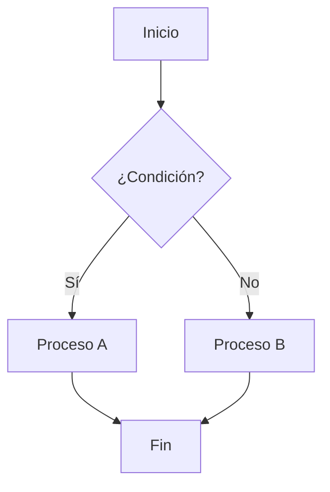
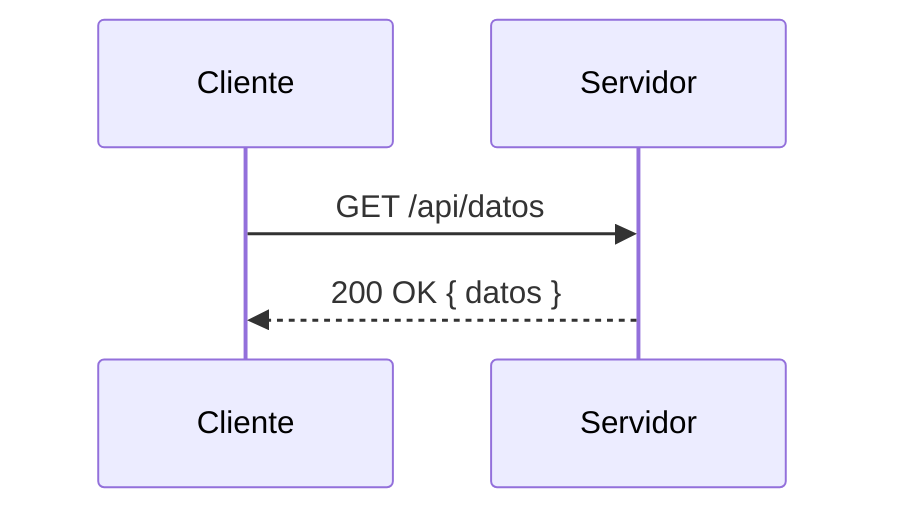
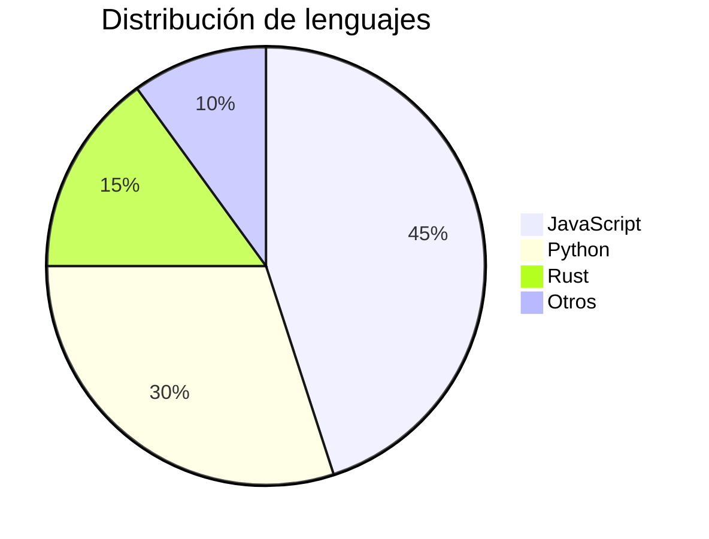

# 📝 Guía de Markdown para Desarrolladores

> Una referencia completa y práctica para escribir Markdown de forma efectiva.

---

## Tabla de contenidos

1. [Introducción a Markdown](#introducción-a-markdown)
2. [CommonMark](#commonmark)
   - [Encabezados](#encabezados)
   - [Párrafos y saltos de línea](#párrafos-y-saltos-de-línea)
   - [Reglas horizontales](#reglas-horizontales)
   - [Negrita y cursiva](#negrita-y-cursiva)
   - [Listas](#listas)
   - [Enlaces](#enlaces)
   - [Imágenes](#imágenes)
   - [Blockquotes](#blockquotes)
   - [Fragmentos de código](#fragmentos-de-código)
   - [Escapado de caracteres especiales](#escapado-de-caracteres-especiales)
   - [HTML en Markdown](#html-en-markdown)
3. [GitHub Flavored Markdown](#github-flavored-markdown)
   - [Tablas](#tablas)
   - [Listas de tareas](#listas-de-tareas)
   - [Tachado](#tachado)
   - [Referencias y menciones](#referencias-y-menciones)
   - [Alertas](#alertas)
   - [Notas a pie de página](#notas-a-pie-de-página)
4. [Sintaxis extendida](#sintaxis-extendida)

---

## Introducción a Markdown

**Markdown** es un lenguaje de marcado ligero creado por John Gruber en 2004. Su objetivo es permitir escribir texto con formato utilizando una sintaxis sencilla y legible en texto plano, que luego puede convertirse a HTML u otros formatos de presentación.

A diferencia de HTML, Markdown está diseñado para que el archivo fuente sea **fácil de leer sin necesidad de renderizarlo**. Es ampliamente utilizado en:

- Documentación de proyectos (`README.md`)
- Plataformas como GitHub, GitLab, Notion y Obsidian
- Generadores de sitios estáticos (Jekyll, Hugo, MkDocs)
- Sistemas de blogs y wikis

Existen varias especificaciones y sabores de Markdown. Las más importantes son:

| Especificación | Descripción |
|---|---|
| **CommonMark** | Estándar formal y sin ambigüedades. Base de la mayoría de implementaciones modernas. |
| **GFM** | GitHub Flavored Markdown. Extensión de CommonMark usada en GitHub. |
| **Extended Markdown** | Funcionalidades adicionales soportadas por herramientas como Pandoc o MkDocs. |

---

## CommonMark

CommonMark es la especificación estándar de Markdown. Define con precisión el comportamiento de cada elemento sintáctico para evitar inconsistencias entre distintos renderizadores.

---

### Encabezados

Los encabezados se crean con el símbolo `#`. Hay seis niveles disponibles, del `h1` al `h6`. Siempre debe haber **un espacio** entre el `#` y el texto.

**Sintaxis:**

````markdown
# Encabezado 1
## Encabezado 2
### Encabezado 3
#### Encabezado 4
##### Encabezado 5
###### Encabezado 6
````

**Resultado visual:**

# Encabezado 1
## Encabezado 2
### Encabezado 3
#### Encabezado 4
##### Encabezado 5
###### Encabezado 6

---

> 💡 **Buena práctica:** Utiliza un solo `h1` por documento. El `h1` generalmente representa el título principal del documento.

---

### Párrafos y saltos de línea

Un **párrafo** se crea simplemente escribiendo texto. Para separar dos párrafos, deja **una línea en blanco** entre ellos.

**Sintaxis:**

```markdown
Este es el primer párrafo. Puede contener varias oraciones
seguidas en el mismo bloque de texto.

Este es el segundo párrafo, separado por una línea en blanco.
```

**Resultado visual:**

Este es el primer párrafo. Puede contener varias oraciones
seguidas en el mismo bloque de texto.

Este es el segundo párrafo, separado por una línea en blanco.

---

Para forzar un **salto de línea** dentro de un párrafo (equivalente a `<br>`), termina la línea con **dos o más espacios** antes del Enter, o usa una barra invertida `\` al final.

**Sintaxis:**

```markdown
Primera línea con salto forzado  
Segunda línea en el mismo párrafo

Primera línea con barra invertida\
Segunda línea en el mismo párrafo
```

**Resultado visual:**

Primera línea con salto forzado  
Segunda línea en el mismo párrafo

---

> ⚠️ **Nota:** No confundas un salto de línea simple (sin doble espacio) con un párrafo nuevo. Un solo Enter sin espacios al final puede unirse en una sola línea según el renderizador.

---

### Reglas horizontales

Una **regla horizontal** (`<hr>`) es una línea divisoria visual. Se puede crear de tres formas equivalentes: con tres o más guiones `---`, asteriscos `***`, o guiones bajos `___`.

**Sintaxis:**

```markdown
---

***

___
```

**Resultado visual:**

---

> 💡 **Consejo:** Se recomienda usar `---` por legibilidad y consistencia. Asegúrate de dejar una línea en blanco antes del separador para evitar que se interprete como un encabezado de nivel 2.

---

### Negrita y cursiva

El énfasis en texto se logra con asteriscos `*` o guiones bajos `_`.

| Efecto | Sintaxis con asteriscos | Sintaxis con guiones bajos |
|---|---|---|
| Cursiva | `*texto*` | `_texto_` |
| Negrita | `**texto**` | `__texto__` |
| Negrita + cursiva | `***texto***` | `___texto___` |

**Sintaxis:**

```markdown
Texto en *cursiva* o _cursiva_.

Texto en **negrita** o __negrita__.

Texto en ***negrita y cursiva*** o ___negrita y cursiva___.

También puedes **combinar _estilos_ dentro** de una misma oración.
```

**Resultado visual:**

Texto en *cursiva* o _cursiva_.

Texto en **negrita** o __negrita__.

Texto en ***negrita y cursiva*** o ___negrita y cursiva___.

También puedes **combinar _estilos_ dentro** de una misma oración.

---

> 💡 **Buena práctica:** Prefiere `*` para cursiva y `**` para negrita. Los guiones bajos pueden causar ambigüedades dentro de palabras con_guiones_bajos en algunos renderizadores.

---

### Listas

#### Listas no ordenadas

Se crean con `-`, `*` o `+` seguidos de un espacio. Se pueden **anidar** con sangría (2 o 4 espacios).

**Sintaxis:**

```markdown
- Elemento 1
- Elemento 2
  - Sub-elemento 2.1
  - Sub-elemento 2.2
    - Sub-elemento 2.2.1
- Elemento 3
```

**Resultado visual:**

- Elemento 1
- Elemento 2
  - Sub-elemento 2.1
  - Sub-elemento 2.2
    - Sub-elemento 2.2.1
- Elemento 3

---

#### Listas ordenadas

Se crean con un número seguido de un punto y un espacio. El número inicial determina el valor de inicio, pero los siguientes números no necesitan ser correlativos.

**Sintaxis:**

```markdown
1. Primer paso
2. Segundo paso
   1. Sub-paso 2.1
   2. Sub-paso 2.2
3. Tercer paso
```

**Resultado visual:**

1. Primer paso
2. Segundo paso
   1. Sub-paso 2.1
   2. Sub-paso 2.2
3. Tercer paso

---

#### Listas con párrafos

Si los elementos de una lista contienen párrafos, sepáralos con una línea en blanco y agrega sangría al contenido.

**Sintaxis:**

```markdown
- **Elemento con párrafo**

  Este párrafo pertenece al primer elemento de la lista.
  Puede extenderse en varias líneas.

- **Segundo elemento**

  Y este párrafo pertenece al segundo elemento.
```

**Resultado visual:**

- **Elemento con párrafo**

  Este párrafo pertenece al primer elemento de la lista.
  Puede extenderse en varias líneas.

- **Segundo elemento**

  Y este párrafo pertenece al segundo elemento.

---

### Enlaces

Hay varias formas de crear enlaces en Markdown.

#### Enlace en línea

**Sintaxis:**

```markdown
[Texto del enlace](https://www.ejemplo.com)

[Enlace con título](https://www.ejemplo.com "Título opcional del enlace")
```

**Resultado visual:**

[Texto del enlace](https://www.ejemplo.com)

[Enlace con título](https://www.ejemplo.com "Título opcional del enlace")

---

#### Enlace de referencia

Los **enlaces de referencia** permiten definir la URL en otro lugar del documento, lo que mejora la legibilidad cuando hay muchos enlaces.

**Sintaxis:**

```markdown
Visita [el sitio oficial][sitio] o lee la [documentación][docs].

[sitio]: https://www.ejemplo.com
[docs]: https://docs.ejemplo.com "Documentación oficial"
```

**Resultado visual:**

Visita [el sitio oficial][sitio] o lee la [documentación][docs].

[sitio]: https://www.ejemplo.com
[docs]: https://docs.ejemplo.com "Documentación oficial"

---

#### Enlace automático (autolink)

Las URLs y correos entre `<>` se convierten automáticamente en enlaces.

**Sintaxis:**

```markdown
<https://www.ejemplo.com>

<contacto@ejemplo.com>
```

**Resultado visual:**

<https://www.ejemplo.com>

<contacto@ejemplo.com>

---

#### Enlace interno (ancla)

Puedes enlazar a cualquier encabezado del mismo documento. GitHub y la mayoría de renderizadores generan IDs automáticos para los encabezados.

**Sintaxis:**

```markdown
[Ir a la sección de Encabezados](#encabezados)
```

> 💡 **Regla:** El ID del ancla es el texto del encabezado en minúsculas, con espacios reemplazados por `-` y sin caracteres especiales.

---

### Imágenes

La sintaxis de imágenes es casi idéntica a la de enlaces, pero con un `!` al inicio. El texto alternativo (`alt`) es importante para accesibilidad.

**Sintaxis:**

```markdown


```

**Resultado visual:**


---

#### Imagen con enlace

Para que una imagen sea clickeable, anida la sintaxis de imagen dentro de la de enlace:

**Sintaxis:**

```markdown
[](https://www.destino.com)
```

---

> 💡 **Buena práctica:** Siempre incluye texto alternativo descriptivo en tus imágenes para mejorar la accesibilidad y el SEO.

---

### Blockquotes

Los **blockquotes** (citas en bloque) se crean con el símbolo `>` al inicio de cada línea. Son útiles para resaltar citas, advertencias o notas.

**Sintaxis:**

```markdown
> Esta es una cita en bloque simple.

> Primera línea de la cita.
> Segunda línea de la misma cita.

> **Citas anidadas:**
>
> > Este es un blockquote dentro de otro blockquote.
```

**Resultado visual:**

> Esta es una cita en bloque simple.

> Primera línea de la cita.
> Segunda línea de la misma cita.

> **Citas anidadas:**
>
> > Este es un blockquote dentro de otro blockquote.

---

Los blockquotes pueden contener otros elementos de Markdown, como encabezados, listas y código:

**Sintaxis:**

```markdown
> ### Título dentro de una cita
>
> - Elemento de lista
> - Otro elemento
>
> `código inline` también funciona aquí.
```

**Resultado visual:**

> ### Título dentro de una cita
>
> - Elemento de lista
> - Otro elemento
>
> `código inline` también funciona aquí.

---

### Fragmentos de código

#### Código en línea (inline)

Para resaltar código dentro de un párrafo, enciérralo entre backticks `` ` ``.

**Sintaxis:**

```markdown
Usa la función `console.log()` para depurar en JavaScript.

Para incluir un backtick en el código, usa dobles backticks: `` `esto es código` ``
```

**Resultado visual:**

Usa la función `console.log()` para depurar en JavaScript.

Para incluir un backtick en el código, usa dobles backticks: `` `esto es código` ``

---

#### Bloques de código (fenced code blocks)

Para bloques de código multilínea, usa tres backticks ` ``` ` al inicio y al final. Puedes especificar el **lenguaje** para el resaltado de sintaxis.

**Sintaxis:**

````markdown
```python
def saludar(nombre):
    """Función que saluda a una persona."""
    return f"Hola, {nombre}!"

print(saludar("Mundo"))
```

```javascript
const saludar = (nombre) => {
  return `Hola, ${nombre}!`;
};

console.log(saludar("Mundo"));
```

```bash
# Clonar un repositorio
git clone https://github.com/usuario/repositorio.git
cd repositorio
npm install
```
````

**Resultado visual:**

```python
def saludar(nombre):
    """Función que saluda a una persona."""
    return f"Hola, {nombre}!"

print(saludar("Mundo"))
```

```javascript
const saludar = (nombre) => {
  return `Hola, ${nombre}!`;
};

console.log(saludar("Mundo"));
```

```bash
# Clonar un repositorio
git clone https://github.com/usuario/repositorio.git
cd repositorio
npm install
```

---

> 💡 **Lenguajes comunes:** `python`, `javascript`, `typescript`, `java`, `c`, `cpp`, `go`, `rust`, `bash`, `sql`, `html`, `css`, `json`, `yaml`, `markdown`, `diff`.

---

#### Bloque de código indentado (alternativo)

Una indentación de **4 espacios** también crea un bloque de código, aunque los fenced code blocks son preferibles por ser más explícitos.

**Sintaxis:**

```markdown
    Este texto con 4 espacios de sangría
    se convierte en un bloque de código.
```

**Resultado visual:**

    Este texto con 4 espacios de sangría
    se convierte en un bloque de código.

---

### Escapado de caracteres especiales

Markdown usa varios caracteres con significado especial. Para mostrarlos literalmente, escápalos con una **barra invertida** `\`.

**Caracteres que pueden escaparse:**

```
\   barra invertida
`   backtick
*   asterisco
_   guión bajo
{}  llaves
[]  corchetes
()  paréntesis
#   almohadilla
+   signo más
-   guión
.   punto
!   signo de exclamación
|   barra vertical (pipe)
```

**Sintaxis:**

```markdown
\*Este texto no está en cursiva\*

\# Esto no es un encabezado

Muestra un \`backtick\` literal sin formato de código.

Precio: \$100.00
```

**Resultado visual:**

\*Este texto no está en cursiva\*

\# Esto no es un encabezado

Muestra un \`backtick\` literal sin formato de código.

Precio: \$100.00

---

### HTML en Markdown

CommonMark permite incluir **HTML directamente** en un documento Markdown. Esto es útil cuando necesitas funcionalidades que Markdown no soporta nativamente.

**Sintaxis:**

```markdown
<strong>Este texto usa HTML para negrita.</strong>

<p align="center">Texto centrado con HTML.</p>

<details>
  <summary>Haz clic para expandir</summary>

  Contenido oculto que se muestra al hacer clic.
  Puedes incluir **Markdown** aquí también.

</details>

<!-- Este es un comentario HTML que no se renderiza -->
```

**Resultado visual:**

<strong>Este texto usa HTML para negrita.</strong>

<p align="center">Texto centrado con HTML.</p>

<details>
  <summary>Haz clic para expandir</summary>

  Contenido oculto que se muestra al hacer clic.
  Puedes incluir **Markdown** aquí también.

</details>

<!-- Este es un comentario HTML que no se renderiza -->

---

> ⚠️ **Precaución:** No todos los renderizadores de Markdown permiten HTML arbitrario por razones de seguridad. GitHub, por ejemplo, filtra ciertos atributos y etiquetas. Úsalo con moderación.

---

## GitHub Flavored Markdown

**GitHub Flavored Markdown (GFM)** es una extensión de CommonMark creada y mantenida por GitHub. Añade características útiles para la colaboración en proyectos de software. La [especificación oficial](https://github.github.com/gfm/) está disponible en su sitio web.

---

### Tablas

GFM agrega soporte para tablas con pipes `|` y guiones `-` para el encabezado.

**Sintaxis:**

```markdown
| Columna 1    | Columna 2    | Columna 3    |
|--------------|--------------|--------------|
| Fila 1, C1   | Fila 1, C2   | Fila 1, C3   |
| Fila 2, C1   | Fila 2, C2   | Fila 2, C3   |
```

**Resultado visual:**

| Columna 1    | Columna 2    | Columna 3    |
|--------------|--------------|--------------|
| Fila 1, C1   | Fila 1, C2   | Fila 1, C3   |
| Fila 2, C1   | Fila 2, C2   | Fila 2, C3   |

---

#### Alineación de columnas

Usa `:` en los separadores para controlar la alineación del texto.

**Sintaxis:**

```markdown
| Izquierda    | Centro       | Derecha      |
|:-------------|:------------:|-------------:|
| alineado     | centrado     | a la derecha |
| a la izq.    | en el medio  | al final     |
```

**Resultado visual:**

| Izquierda    | Centro       | Derecha      |
|:-------------|:------------:|-------------:|
| alineado     | centrado     | a la derecha |
| a la izq.    | en el medio  | al final     |

---

> 💡 **Tip:** Las celdas de la tabla pueden contener formato Markdown inline como **negrita**, _cursiva_, `código`, y [enlaces](https://github.com). No se permiten bloques multilínea dentro de celdas.

---

### Listas de tareas

Las **listas de tareas** (task lists o checklists) permiten crear listas con casillas de verificación. Son especialmente útiles en issues y pull requests de GitHub.

**Sintaxis:**

```markdown
- [x] Tarea completada
- [ ] Tarea pendiente
- [x] Otra tarea completada
- [ ] Revisar la documentación
- [ ] Agregar pruebas unitarias
```

**Resultado visual:**

- [x] Tarea completada
- [ ] Tarea pendiente
- [x] Otra tarea completada
- [ ] Revisar la documentación
- [ ] Agregar pruebas unitarias

---

> 💡 **En GitHub:** Las casillas son interactivas en issues y pull requests, y puedes marcarlas/desmarcarlas directamente en la interfaz sin editar el Markdown.

---

### Tachado

El texto tachado se crea encerrándolo entre dobles virgulillas `~~`. Es útil para mostrar texto eliminado o deprecado.

**Sintaxis:**

```markdown
~~Este texto está tachado.~~

La función ~~`calcularTotal()`~~ ha sido reemplazada por `obtenerSuma()`.
```

**Resultado visual:**

~~Este texto está tachado.~~

La función ~~`calcularTotal()`~~ ha sido reemplazada por `obtenerSuma()`.

---

### Referencias y menciones

GFM permite crear referencias automáticas a issues, pull requests, commits y usuarios en el contexto de un repositorio de GitHub.

#### Menciones a usuarios

**Sintaxis:**

```markdown
@usuario - Menciona a un usuario de GitHub y le envía una notificación.

@organization/team - Menciona a todos los miembros de un equipo.
```

---

#### Referencias a issues y pull requests

**Sintaxis:**

```markdown
Fixes #42          → Referencia al issue #42 (y lo cierra al hacer merge)
See also #100      → Referencia al issue/PR #100
Closes #55         → Cierra el issue #55 al hacer merge del PR

Palabras clave que cierran issues al mergear:
close, closes, closed, fix, fixes, fixed, resolve, resolves, resolved
```

---

#### Referencias a commits

**Sintaxis:**

```markdown
a1b2c3d                     → Hash corto del commit (7 caracteres mínimo)
usuario/repositorio@a1b2c3d → Commit en otro repositorio
```

---

#### Referencias cruzadas entre repositorios

**Sintaxis:**

```markdown
usuario/repositorio#42      → Issue #42 en otro repositorio
```

---

### Alertas

Las alertas (también llamadas **callouts**) son una extensión de los blockquotes que muestran información destacada con un ícono y color específico. Son soportadas en GitHub, Obsidian y otros renderizadores modernos.

**Sintaxis:**

```markdown
> [!NOTE]
> Información útil que los usuarios deben conocer, aunque es opcional para continuar.

> [!TIP]
> Consejo opcional para hacer algo mejor o de forma más sencilla.

> [!IMPORTANT]
> Información clave que los usuarios necesitan conocer para lograr su objetivo.

> [!WARNING]
> Información urgente que requiere atención inmediata para evitar problemas.

> [!CAUTION]
> Consecuencias negativas de ciertas acciones que el usuario debe conocer.
```

**Resultado visual:**

> [!NOTE]
> Información útil que los usuarios deben conocer, aunque es opcional para continuar.

> [!TIP]
> Consejo opcional para hacer algo mejor o de forma más sencilla.

> [!IMPORTANT]
> Información clave que los usuarios necesitan conocer para lograr su objetivo.

> [!WARNING]
> Información urgente que requiere atención inmediata para evitar problemas.

> [!CAUTION]
> Consecuencias negativas de ciertas acciones que el usuario debe conocer.

---

> ⚠️ **Compatibilidad:** Las alertas con `[!NOTE]`, `[!WARNING]`, etc. son nativas de GitHub. En otros renderizadores pueden aparecer como blockquotes normales sin el formato especial.

---

### Notas a pie de página

Las notas a pie de página permiten añadir referencias o aclaraciones sin interrumpir el flujo del texto principal.

**Sintaxis:**

```markdown
Este es un texto con una nota al pie.[^1]

También puedes usar identificadores descriptivos.[^nota-importante]

[^1]: Esta es la nota al pie número 1.

[^nota-importante]: Esta nota usa un identificador descriptivo en lugar de un número.
    Puede extenderse en múltiples líneas con 4 espacios de sangría.
```

**Resultado visual:**

Este es un texto con una nota al pie.[^1]

También puedes usar identificadores descriptivos.[^nota-importante]

[^1]: Esta es la nota al pie número 1.

[^nota-importante]: Esta nota usa un identificador descriptivo en lugar de un número.
    Puede extenderse en múltiples líneas con 4 espacios de sangría.

---

> 💡 **Nota:** Las referencias `[^n]` se renderizan como superíndices clicables, y las definiciones se reubican automáticamente al final del documento.

---

## Sintaxis extendida

Más allá de CommonMark y GFM, existen extensiones adicionales soportadas por herramientas como **Pandoc**, **MkDocs**, **Obsidian**, y otros procesadores avanzados de Markdown.

---

### Resaltado de texto

Algunos renderizadores (Obsidian, Typora) soportan resaltado con `==`.

**Sintaxis:**

```markdown
Este texto tiene una ==palabra resaltada== en amarillo.
```

**Resultado visual** *(en renderizadores compatibles)*:

Este texto tiene una ==palabra resaltada== en amarillo.

---

### Subíndices y superíndices

Soportado por Pandoc, MkDocs Material y algunos plugins.

**Sintaxis:**

```markdown
H~2~O es la fórmula del agua.        <!-- Subíndice -->

E = mc^2^ es la ecuación de Einstein. <!-- Superíndice -->
```

**Resultado visual** *(en renderizadores compatibles)*:

H~2~O es la fórmula del agua.

E = mc^2^ es la ecuación de Einstein.

---

### Definiciones

Pandoc y algunos renderizadores soportan listas de definición al estilo HTML `<dl>`.

**Sintaxis:**

```markdown
Markdown
:   Lenguaje de marcado ligero creado por John Gruber.

HTML
:   HyperText Markup Language. Lenguaje estándar para páginas web.

CommonMark
:   Especificación formal y sin ambigüedades de Markdown.
```

**Resultado visual** *(en renderizadores compatibles)*:

Markdown
:   Lenguaje de marcado ligero creado por John Gruber.

HTML
:   HyperText Markup Language. Lenguaje estándar para páginas web.

CommonMark
:   Especificación formal y sin ambigüedades de Markdown.

---

### Bloques de código con metadatos

Herramientas como MkDocs Material permiten agregar metadatos a los bloques de código, como números de línea, título y líneas resaltadas.

**Sintaxis:**

````markdown
```python title="ejemplo.py" linenums="1" hl_lines="2 3"
def saludar(nombre):
    mensaje = f"Hola, {nombre}!"
    return mensaje

print(saludar("Mundo"))
```
````

---

### Diagramas con Mermaid

Mermaid es una librería de diagramas que se integra en GitHub, GitLab, Notion y otras plataformas. Se escribe como un bloque de código con el lenguaje `mermaid`.

**Sintaxis:**

````markdown

````

**Resultado visual** *(en GitHub y otros renderizadores compatibles)*:


---

**Otros tipos de diagramas Mermaid:**

````markdown



````

**Resultado:** 


---

### Matemáticas con LaTeX

Plataformas como GitHub (desde 2022), Jupyter Notebooks y MkDocs Material soportan expresiones matemáticas con LaTeX mediante `$` para inline y `$$` para bloques.

**Sintaxis:**

```markdown
La ecuación cuadrática es $ax^2 + bx + c = 0$.

Su solución es:

$$
x = \frac{-b \pm \sqrt{b^2 - 4ac}}{2a}
$$
```

**Resultado visual** *(en renderizadores compatibles)*:

La ecuación cuadrática es $ax^2 + bx + c = 0$.

Su solución es:

$$
x = \frac{-b \pm \sqrt{b^2 - 4ac}}{2a}
$$

---

### Abreviaciones

Pandoc y MkDocs Material soportan la definición de abreviaciones que se convierten en elementos `<abbr>` al renderizar.

**Sintaxis:**

```markdown
La especificación HTML es mantenida por el W3C.

*[HTML]: HyperText Markup Language
*[W3C]: World Wide Web Consortium
```

---

### Tabla de referencia rápida

| Elemento                | CommonMark | GFM | Extendido |
| :---------------------- | :--------: | :-: | :-------: |
| Encabezados             |     ✅      |  ✅  |     ✅     |
| Párrafos                |     ✅      |  ✅  |     ✅     |
| Negrita / Cursiva       |     ✅      |  ✅  |     ✅     |
| Listas                  |     ✅      |  ✅  |     ✅     |
| Enlaces                 |     ✅      |  ✅  |     ✅     |
| Imágenes                |     ✅      |  ✅  |     ✅     |
| Blockquotes             |     ✅      |  ✅  |     ✅     |
| Código inline           |     ✅      |  ✅  |     ✅     |
| Bloques de código       |     ✅      |  ✅  |     ✅     |
| HTML inline             |     ✅      |  ✅  |     ✅     |
| Tablas                  |     ❌      |  ✅  |     ✅     |
| Listas de tareas        |     ❌      |  ✅  |     ✅     |
| Tachado                 |     ❌      |  ✅  |     ✅     |
| Referencias/menciones   |     ❌      |  ✅  |     ✅     |
| Alertas (callouts)      |     ❌      |  ✅  |     ✅     |
| Notas al pie            |     ❌      |  ✅  |     ✅     |
| Resaltado `==`          |     ❌      |  ❌  |     ✅     |
| Subíndice / Superíndice |     ❌      |  ❌  |     ✅     |
| Diagramas Mermaid       |     ❌      |  ✅  |     ✅     |
| Matemáticas LaTeX       |     ❌      |  ✅  |     ✅     |
| Definiciones            |     ❌      |  ❌  |     ✅     |

---

## Recursos adicionales

- 📖 [Especificación CommonMark](https://spec.commonmark.org/) — Referencia técnica completa y oficial.
- 📖 [Especificación GFM](https://github.github.com/gfm/) — GitHub Flavored Markdown oficial.
- 🛠️ [Dingus CommonMark](https://spec.commonmark.org/dingus/) — Playground online para probar CommonMark.
- 🛠️ [Markdown Guide](https://www.markdownguide.org/) — Guía de referencia con ejemplos interactivos.
- 🛠️ [Mermaid Live Editor](https://mermaid.live/) — Editor online para diagramas Mermaid.
- 🛠️ [Tables Generator](https://www.tablesgenerator.com/markdown_tables) — Generador visual de tablas Markdown.

---

*Guía elaborada con ❤️ para desarrolladores. Última actualización: 2026.*
